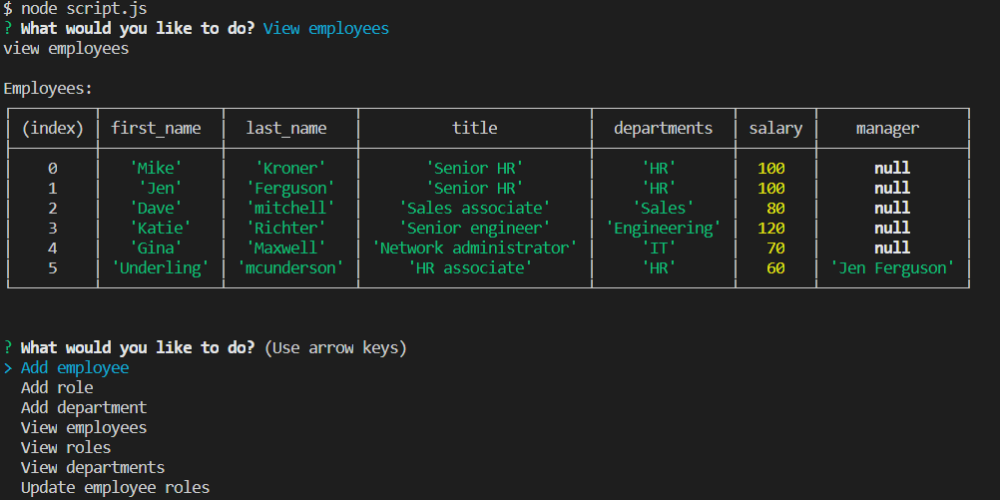

# Unit SQL Employee Tracker

This app lets you view and manage an sql database containing the roles, departments, and employees for a company.

## Technologies Used
 - Node.js
 - inquirer
 - mysql

## Install
- npm init -y to initialize our package.json file
- npm install inquirer for the command line prompts
- npm install mysql for the SQL

- run the program with node script.js

## Author

**Sammy Kroner**

[LinkedIn](www.linkedin.com/in/samuel-kroner-44aa11169)

[GitHub](https://github.com/sammyk118)

## Acknowledgements
UC Berkeley Extension